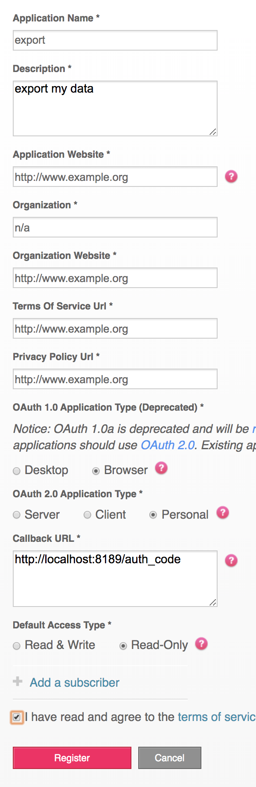

# MyFitbit

Because *"Your data belongs to you!"*

...and fitbit's own data export sucks.


[](https://travis-ci.org/Knio/nostalgia_fitbit)
[](https://coveralls.io/r/Knio/nostalgia_fitbit?branch=master)
[](https://pypi.org/project/nostalgia_fitbit/)
[](https://pypi.org/project/nostalgia_fitbit/)

## Installation

    pip install nostalgia_fitbit

## Setup

`nostalgia_fitbit` assumes a registered app.

To get started, follow the prompts after running (will open a browser):

    nostalgia_fitbit


The app should look like this:

The Callback URL must be exactly `http://localhost:8189/auth_code`



Note that the fitbit API is rate limited to 150 calls/hour, and you can query only 1 day of heartrate data at a time. If you many days of data, you will be rate limited and see an HTTP 429 error. Simply re-run the command an hour later and it will resume downloading where it left off.


## Generate report

Note: This is not officially supported by nostalgia

```
python3 -m nostalgia_fitbit.report --user 123ABC
```

Use the user id seen in the output from step 2

This will generate `report.html` in your current working directory.


